# Neuvia

**A notebook that turns your learning goal into an interactive roadmap.**

Describe what you want to learn, optionally with your own notes. Neuvia builds a curriculum of milestones and
fills it with short AI-generated lessons. To learn actively, you drag quizzes, flashcards, summaries and
"In Your Own Words" exercises onto any lesson.

University project · Dec 2025 – Jan 2026 · Prototyping Entrepreneurial Ideas in New Technology 

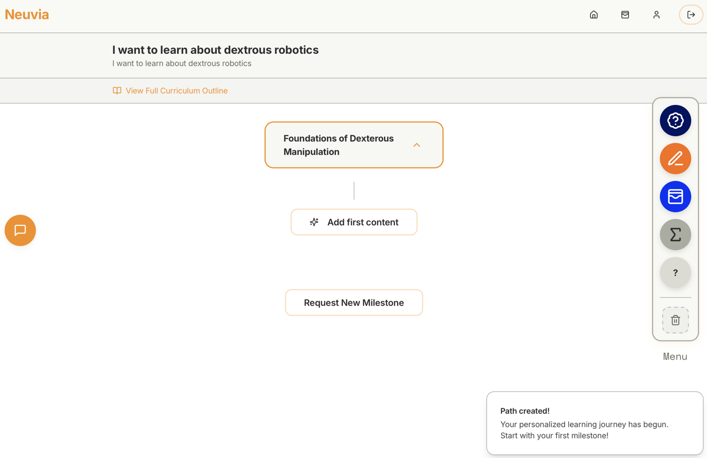

▶️ **[Watch the video walkthrough (2:23)](public/tutorial.mp4)**

## Why

When you juggle several courses, a lot of "study time" goes into busywork: organising folders, writing summaries,
and re-learning context after a few days away from a topic. Neuvia keeps the thread for you. Each subject gets one
roadmap that remembers where you are, so you can pick up again without a long warm-up.

## How it works

### 1. Set a goal

Enter what you want to learn plus any context: prior knowledge, lecture notes, what you're aiming for. The AI
turns it into a curriculum of ordered milestones.

<p align="center">
  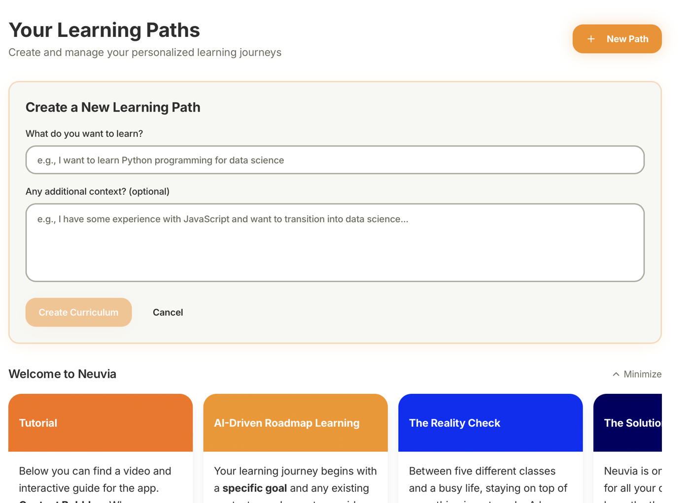
  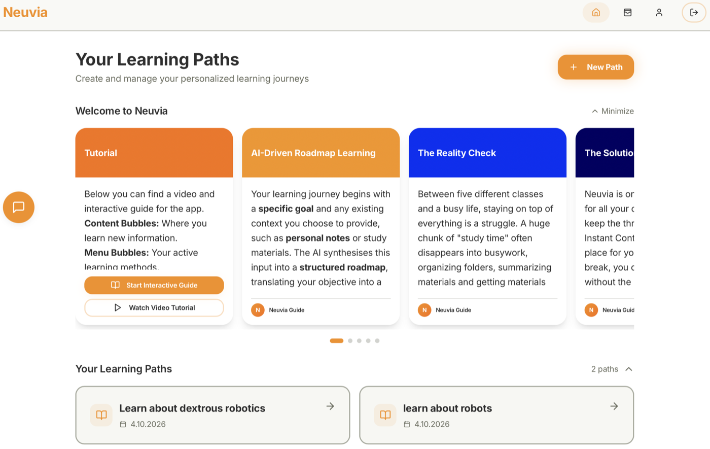
</p>

### 2. Generate lessons

Each milestone starts with a suggested topic. Refine it or write your own, and Neuvia generates a markdown lesson
(a *content bubble*). Every lesson proposes the next topic, so the path grows as you learn.

<p align="center">
  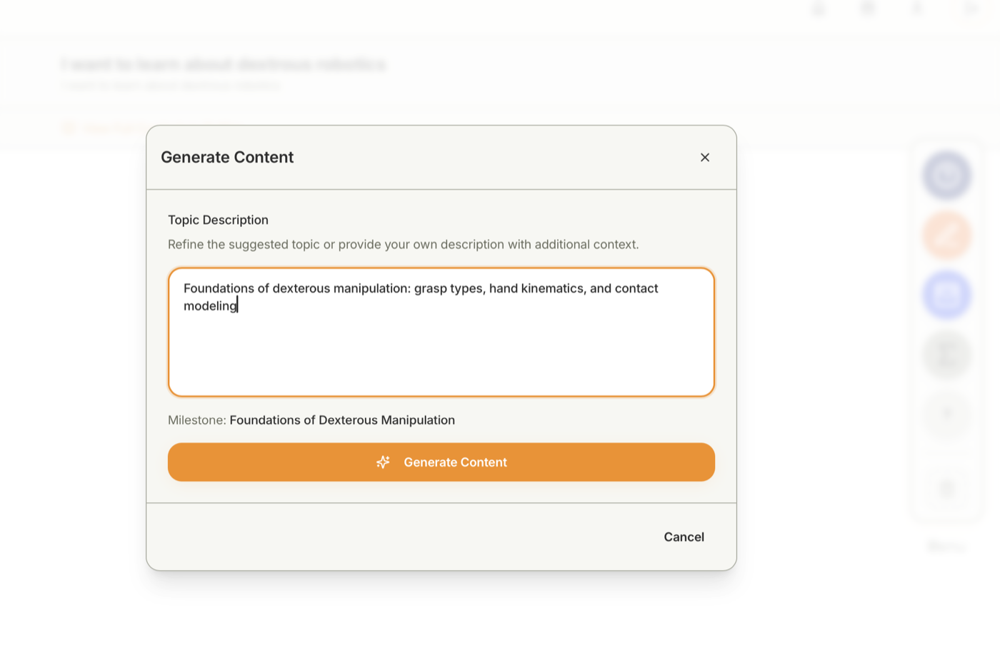
  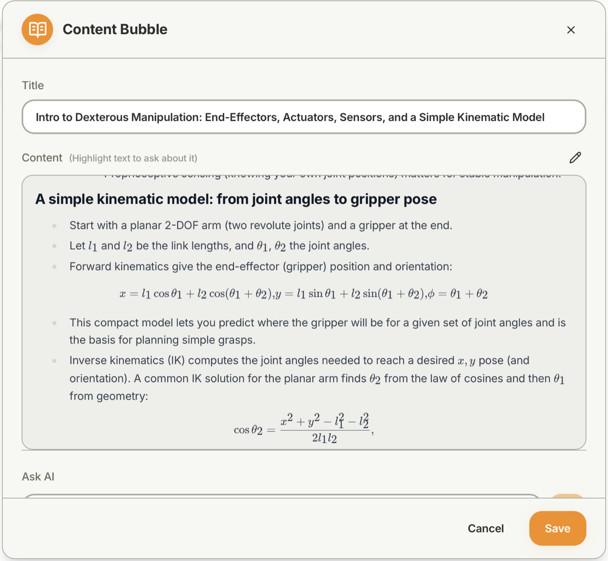
</p>

Lessons, quizzes, flashcards and feedback render math properly (KaTeX), so formulas like a PID control law read
like a textbook instead of `K_p*e[k] + ...`.

### 3. Ask about anything you highlight

Select a passage in a lesson and ask a question about it. The selection, including formulas as LaTeX, goes to the
AI together with the lesson as context.

<p align="center">
  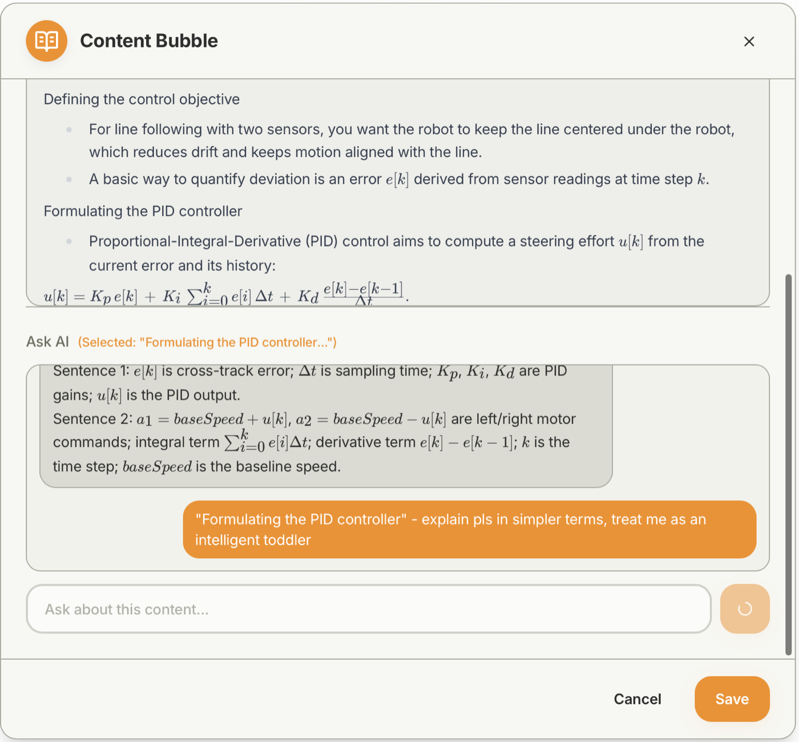
</p>

### 4. Learn actively

Drag a tool from the menu on the right onto a lesson and it attaches to that lesson as a small bubble.

<p align="center">
  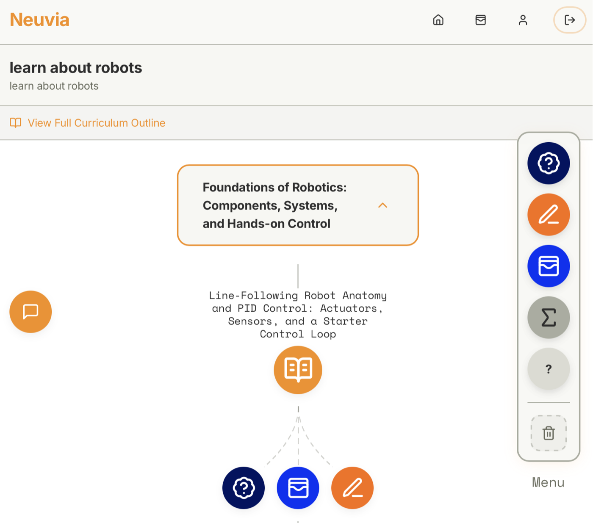
</p>

| Quiz | In Your Own Words |
|---|---|
| 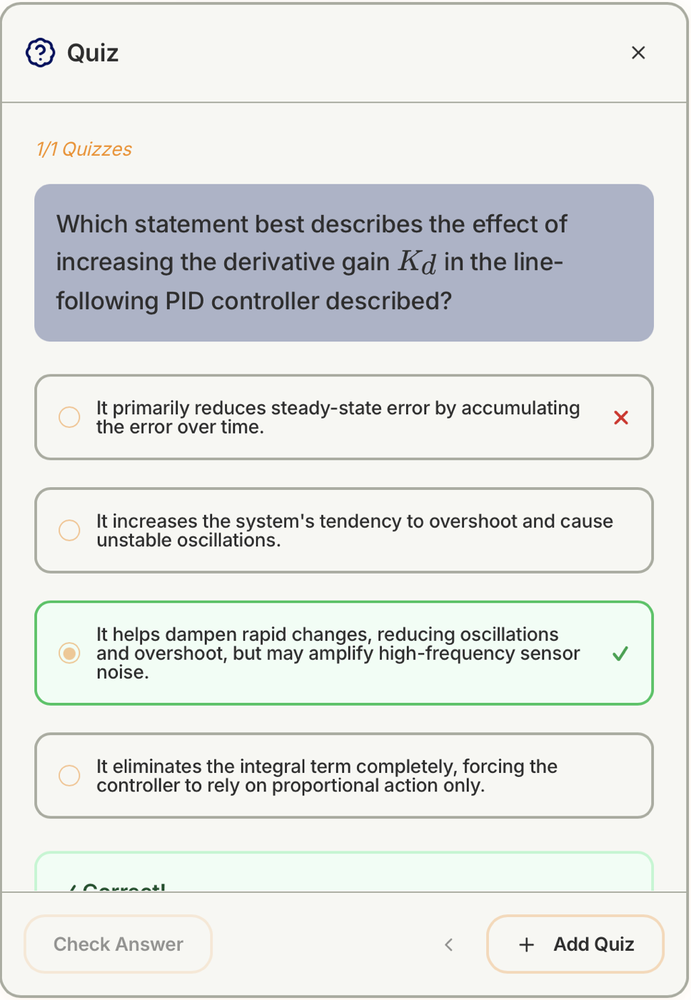 | 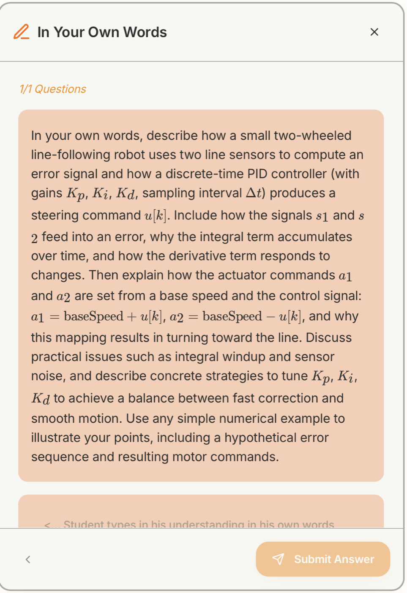 |
| Multiple-choice questions generated from the lesson, with instant feedback. | Explain the concept yourself; the AI evaluates your answer and points out gaps. |

| Flashcards | Learning Summary |
|---|---|
| 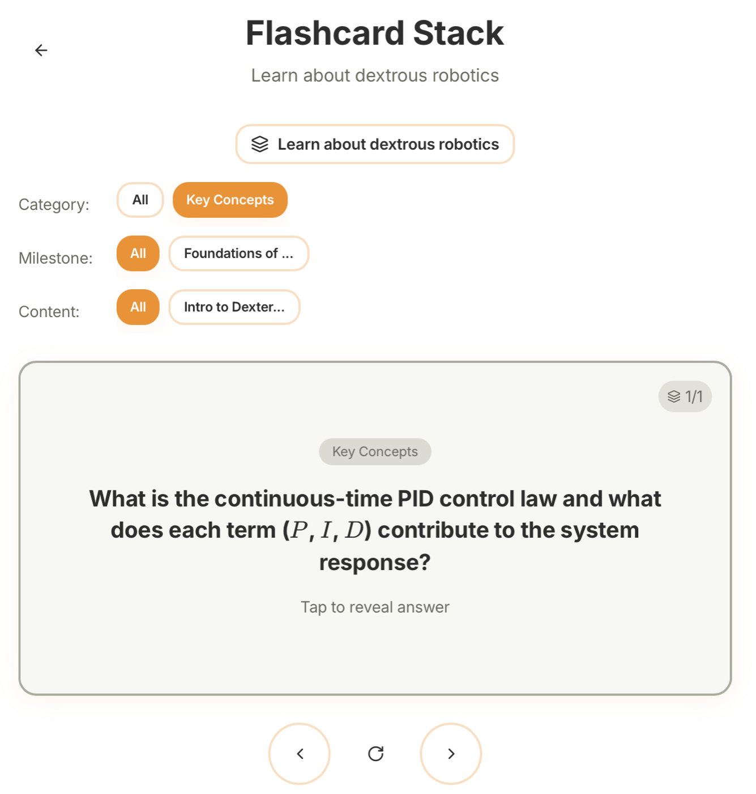 | 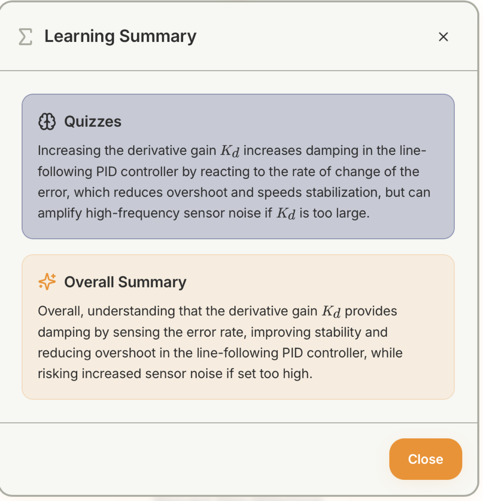 |
| Generate or write cards; all cards of a path are collected in a flashcard stack to study, filterable by milestone and lesson. | Combines what you did in the quiz and IOW exercises into key takeaways. |

### 5. Keep going

When you finish a milestone, mark it complete. You can then let the AI propose the next milestone based on your
progress, or define it yourself.

## Highlights

- **Structured AI output**: the edge functions return JSON (via OpenAI tool calls or JSON responses), so the app
  works with typed data like milestones, questions and evaluations instead of free text
- **Background generation**: close a modal mid-generation and keep working; the result saves itself when it's done,
  and the bubble shows a spinner until then
- **Row-level security**: every table is scoped to the signed-in user through Postgres RLS policies
- **Authenticated AI endpoints**: every edge function checks for a valid user session before calling OpenAI,
  so the API key can't be used by anyone who just knows the URL
- **Drag and drop with mouse and touch** for attaching learning tools to lessons
- **Math rendering that survives model mistakes**: KaTeX in the frontend, plus repairs for the typical errors of a
  small model (mis-escaped backslashes in JSON, a forgotten `$`, plain-text subscripts)

## Tech stack

| Layer | Tech |
|---|---|
| Frontend | React 19, TypeScript, Vite, Tailwind CSS, shadcn/ui, TanStack Query, KaTeX |
| Backend | Supabase (Postgres with row-level security, Auth, Storage) |
| AI | OpenAI via 11 Supabase Edge Functions (Deno) |
| Hosting | Vercel |

```
LearningPath
 └─ Milestone[]
     └─ ContentBubble[]            markdown lesson + suggested next topic
         └─ Interaction[]          quiz · flashcard · iow · summary · help
```

## Running locally

Requirements: Node 18+, Docker, the [Supabase CLI](https://supabase.com/docs/guides/cli), and an OpenAI API key.

```bash
npm install

# 1. Start a local Supabase stack (applies all migrations)
supabase start

# 2. Serve the edge functions with your OpenAI key
echo "OPENAI_API_KEY=sk-..." > supabase/functions/.env
supabase functions serve --env-file supabase/functions/.env

# 3. In a second terminal: point the frontend at the local stack.
#    Use the API URL and publishable key printed by `supabase start`.
cp .env.example .env
npm run dev          # http://localhost:5173
```

## Project structure

```
src/
  pages/                 Dashboard, Roadmap, Stack (flashcards), Auth, Profile
  components/roadmap/    canvas, bubble nodes, one modal per bubble type
  hooks/                 useLearningPath (data + CRUD), useGenerationManager (background AI tasks)
supabase/
  functions/             edge functions + shared OpenAI helper
  migrations/            database schema and RLS policies
```

## Status

A prototype from a university course; it's no longer actively developed. The first scaffold was generated with
Lovable, and the app was then built out by hand and with claude.
